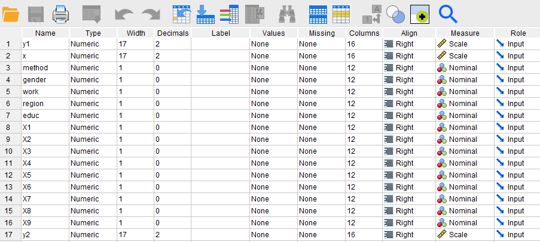
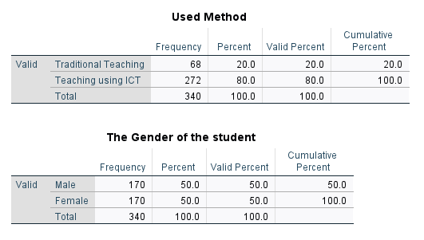
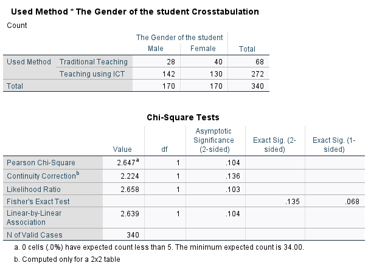
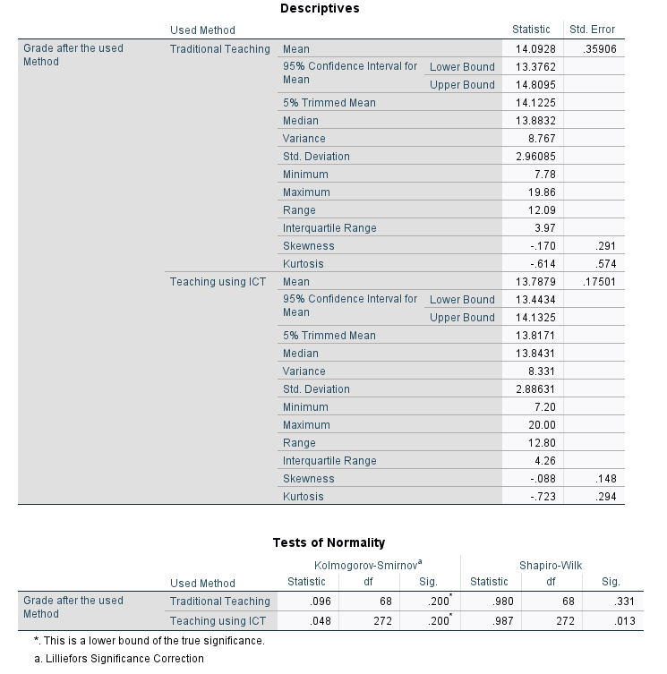
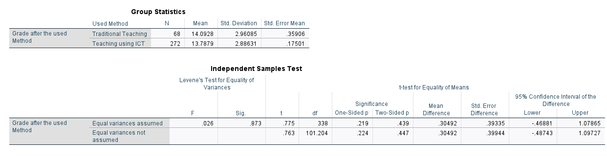
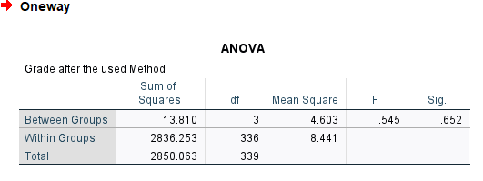
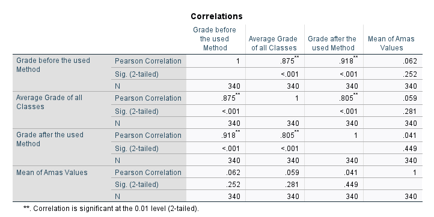
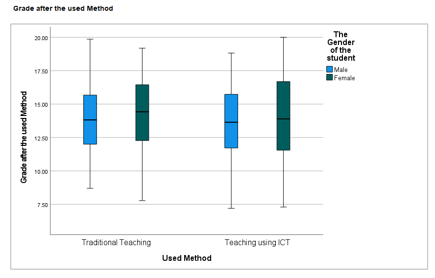
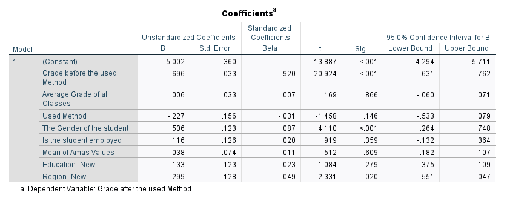

# Spss-Case-Study

## Project overview
Two teaching methods were used in a group of students. We got our data and we are ready!
- Teaching Methods Comparison
- Various Reports

## Prepare Phase 
Data downloaded from Coursity, imported in SPSS, and named “Case3”.
Check the **[File](https://github.com/DimKaisaris/Spss-Case-Study/blob/main/Processed%20Files/Ask%20Phase(english)1.docx)** for details and
the **[Data](https://github.com/DimKaisaris/Spss-Case-Study/tree/main/Raw%20Files)** for the raw data if you wish!

## Analysis Phase
Check the **[File](https://github.com/DimKaisaris/Spss-Case-Study/blob/main/Processed%20Files/Analysis%20Phase.docx)** to see all the tasks completed.
We set our new variables and values, check the **[file](https://github.com/DimKaisaris/Spss-Case-Study/blob/main/Processed%20Files/Case3.sav)** which is ready for analysis.

1.	Descriptive Statistics Frequencies: **[report](https://github.com/DimKaisaris/Spss-Case-Study/blob/main/Reports/Descriptive%20Statistics.spv)**

	 

2.	Crosstabs, Chi-Squares: **[report](https://github.com/DimKaisaris/Spss-Case-Study/blob/main/Reports/Chi-Square.spv)**

3.	Explore, Normality Test: **[report](https://github.com/DimKaisaris/Spss-Case-Study/blob/main/Reports/Descriptives-Normality%20Test.spv)**

4.	T-Test, Independent Samples: **[report](https://github.com/DimKaisaris/Spss-Case-Study/blob/main/Reports/T-Test%2C%20Independent%20Samples%20Test.spv)**

5.	Anova: **[report](https://github.com/DimKaisaris/Spss-Case-Study/blob/main/Reports/Anova%2C%20Grade%20After-Educ.spv)**

6.	Correlation-Bivariate: **[report](https://github.com/DimKaisaris/Spss-Case-Study/blob/main/Reports/Correlations.spv)**

7.	Graphs: **[report](https://github.com/DimKaisaris/Spss-Case-Study/blob/main/Reports/Graphs.spv)**

8.	Linear Regression: **[report](https://github.com/DimKaisaris/Spss-Case-Study/blob/main/Reports/Linear%20Regression.spv)**

